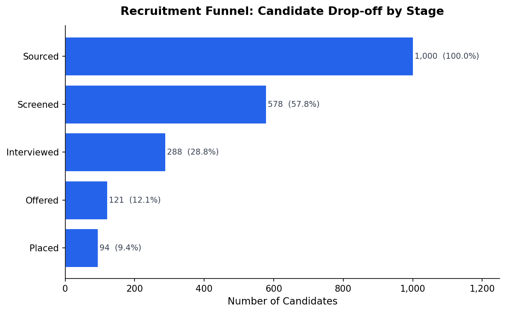
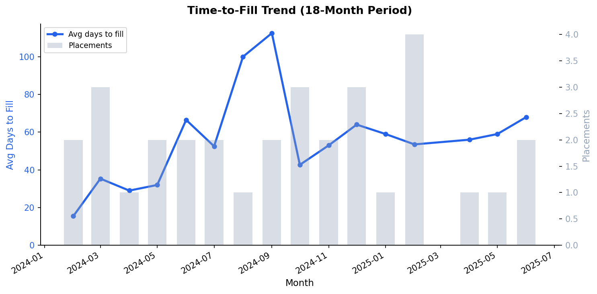
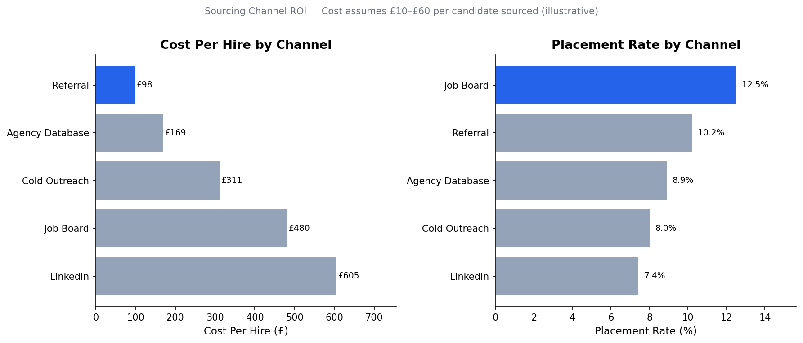
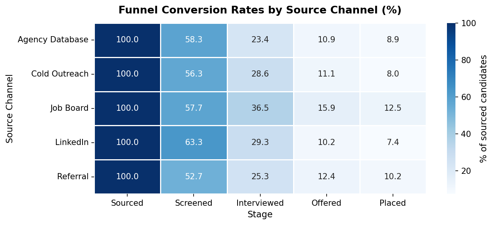
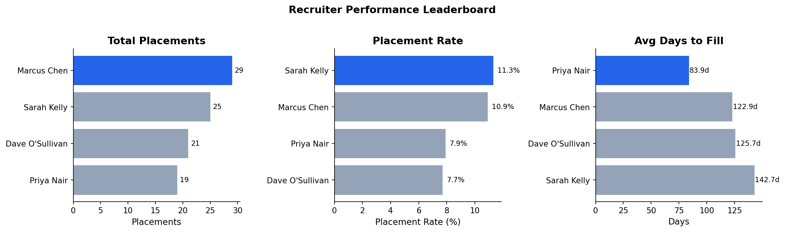

# Recruitment Funnel & Sourcing ROI Analytics

A data analyst portfolio project built on real experience. As a Recruitment Consultant at Cobalt Recruitment (2023), I tracked candidate conversion rates and sourcing effectiveness manually in spreadsheets. This project rebuilds that workflow properly — relational database, SQL analysis, Python exploration, interactive dashboard, and a predictive model.

**Stack:** SQLite · Python · Pandas · Matplotlib · Plotly · scikit-learn · Jupyter

---

## Quick Start

```bash
# 1. Clone the repo
git clone https://github.com/Cianomahony123/recruitment-funnel-analytics.git
cd recruitment-funnel-analytics

# 2. Install dependencies
pip install -r requirements.txt

# 3. Generate the database
cd data && python generate_data.py && cd ..

# 4. Open the interactive dashboard
python generate_dashboard.py
# → opens outputs/dashboard.html in your browser

# 5. (Optional) Run the full analysis notebooks
jupyter notebook analysis/
# Run in order: 01 → 02 → 03 → 04
```

> **Python 3.9+ required.** No database setup needed — SQLite is built into Python.

---

## The Problem

Recruitment agencies make channel-allocation decisions — where to source candidates — largely on gut feel or raw headcount numbers. Those numbers hide the real story: a channel that generates 200 candidates but converts at 5% is worse than one that generates 80 at 15%. The questions that actually matter are:

- Which sourcing channels produce placements most cost-effectively?
- How long does it take to fill different role types, and is it getting better or worse?
- Which recruiters are most effective, and through which channels?

---

## Results

### 1. Funnel Drop-off



**Takeaway:** Less than 1 in 10 sourced candidates is ultimately placed. The biggest drop occurs at screening — improving screener quality has more leverage than sourcing more volume.

---

### 2. Time-to-Fill Trend



**Takeaway:** Average time-to-fill varies significantly across the 18-month period. Monitoring this monthly catches market slowdowns before they become client escalations.

---

### 3. Sourcing Channel ROI



**Takeaway:** Referrals deliver the lowest cost-per-hire by a significant margin. Job Board candidates are the most expensive to convert. The data supports shifting sourcing budget toward referral cultivation and Agency Database outreach over paid listings.

> Cost-per-sourced-candidate figures (£10–£60 depending on channel) are illustrative assumptions. Swap in real platform costs for a production version.

---

### 4. Channel Conversion Heatmap



**Takeaway:** Conversion rates vary meaningfully across channels at every stage — this is not just a volume story. Channel quality differs at interview and offer stages, not just sourcing.

---

### 5. Recruiter Leaderboard



**Takeaway:** Total placements and placement rate don't always rank recruiters the same way. Combining both metrics gives a fuller picture than either alone.

---

## Key Business Recommendations

1. **Shift sourcing budget toward Referrals and Agency Database** — lower cost-per-hire, higher placement rates.
2. **Set a time-to-fill threshold alert** — roles trending past the average for their type warrant early intervention.
3. **Screen harder, source smarter** — improving screened→interviewed conversion by 10pp delivers more placements than a 20% increase in sourcing volume.
4. **Track recruiter performance on conversion rate, not just placements** — headcount targets incentivise volume; conversion rate incentivises quality.

---

## Interactive Dashboard

Run `python generate_dashboard.py` to produce a self-contained interactive dashboard (`outputs/dashboard.html`) — hover tooltips, zoom, and all charts on one page.

The script accepts arguments for use with different datasets:

```bash
# Point at a different database
python generate_dashboard.py --db path/to/other.db

# Override channel costs (default: LinkedIn=£45, Referral=£10, Job Board=£60...)
python generate_dashboard.py --costs "LinkedIn=45,Referral=10,JobBoard=60"

# Custom title and author
python generate_dashboard.py --title "Acme Recruitment" --author "Jane Smith"
```

---

## Bonus: Predictive Model

A logistic regression (`analysis/04_predictive_model.ipynb`) predicts whether a sourced candidate will be placed, using source channel, years of experience, salary alignment to role band, and recruiter.

Key finding: **source channel is the strongest predictor of placement**. The model's value here is less about accuracy (synthetic data makes metrics illustrative) and more about demonstrating a sound ML workflow — feature engineering, train/test split, standardisation, and coefficient interpretation tied back to business meaning.

---

## Project Structure

```
recruitment-funnel-analytics/
├── README.md
├── requirements.txt
├── generate_dashboard.py      # → outputs/dashboard.html
├── data/
│   └── generate_data.py       # synthetic data generator
├── database/
│   └── schema.sql             # DDL reference (db generated at runtime)
├── sql/
│   ├── 01_conversion_rates.sql
│   ├── 02_time_to_fill.sql
│   ├── 03_sourcing_roi.sql
│   └── 04_recruiter_performance.sql
├── analysis/
│   ├── 01_data_cleaning.ipynb
│   ├── 02_funnel_analysis.ipynb
│   ├── 03_visualizations.ipynb
│   └── 04_predictive_model.ipynb
├── outputs/
│   ├── charts/                # exported PNGs embedded in this README
│   └── dashboard.html         # interactive Plotly dashboard
└── models/
    └── placement_model.pkl    # trained logistic regression
```

---

## Data

Synthetic dataset simulating 18 months of agency activity (Jan 2024 – Jun 2025):

| Table | Rows | Notes |
|---|---|---|
| `candidates` | ~1,015 | includes ~15 intentional duplicates |
| `pipeline_stages` | ~3,000 | one row per stage per candidate |
| `roles` | 50 | across 18 fictional clients, 6 industries |
| `clients` | 18 | |

Intentional messiness: ~8% inconsistent `source_channel` casing, ~5% missing `years_experience`, ~4% missing `expected_salary`, ~1.5% duplicate rows — so the project can show data cleaning skills, not just analysis of pristine data.

---

## What I'd Do With Real Data

- **Real channel costs** — plug in actual LinkedIn Recruiter seat costs, job board fees, and referral bonuses for true ROI figures.
- **Post-placement retention** — with a real ATS, you'd have interview feedback scores and 6-month retention data, making the predictive model substantially more useful.
- **Live monitoring** — wiring `generate_data.py` to a real ATS export and scheduling a weekly run would turn this from a retrospective analysis into an operational tool.

---

*Cian O'Mahony · [cianomahony10@gmail.com](mailto:cianomahony10@gmail.com)*
